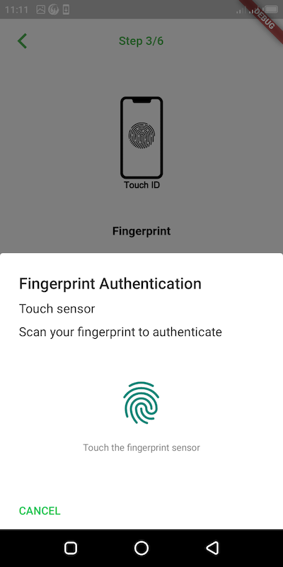
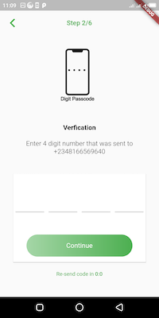
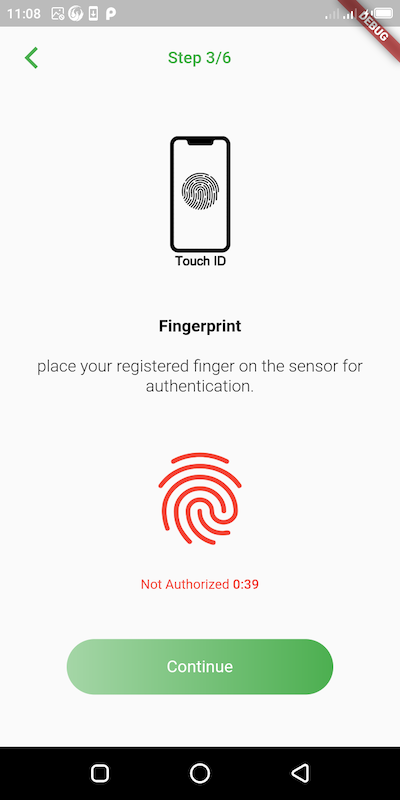

# flutter_authentication

A simple flutter application that demonstrates authentication with pin or OTP sent via sms and also Fingerprint.

## Getting Started

This project presents a simple UI layout to assist with the demonstration. Structured code to allow users understand the logic.

### Android
The permissions for android are compulsory and should be placed inside AndroidManifest.xml as displayed in this project.
'FlutterFragmentActivity' is compulsory and should be factored inside MainActivty class as displayed in this project.

### IOS
Include the following (excluding the brackets) 
[ 	<key>NSFaceIDUsageDescription</key>
              <string>Why is my app authenticating using face id?</string>
]

inside ios/Runner/info.plist file as demonstrated in this project.

## Dependencies
- [pin_view](https://pub.dev/packages/pin_view)
- [local_auth](https://pub.dev/packages/local_auth)

## Design Inspiration
- [Dribble UI Template](https://dribbble.com/shots/5401676)

## Flutter UI Implementation

- [Lab: Write your first Flutter app](https://flutter.dev/docs/get-started/codelab)
- [Cookbook: Useful Flutter samples](https://flutter.dev/docs/cookbook)

For help getting started with Flutter, view our
[online documentation](https://flutter.dev/docs), which offers tutorials,
samples, guidance on mobile development, and a full API reference.
